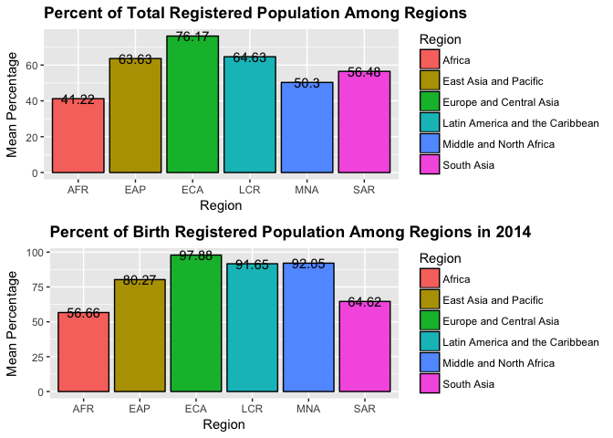
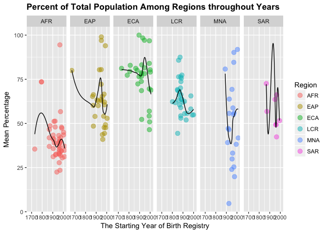

# Background
There are an estimated 1.5 billion people around the world who do not have an official document to prove their identity. To help those poor and vulnerble have a formally recognized identity, The World Bank launched the "ID4D" project in 2015. Based on the data provided by the World Bank, in here, we initially explore the data and take a look into some specific variables to visualize several facts that are existing beneath the data via different aspects. 


```r
library(gdata)
library(ggplot2)
library(dplyr)
# Read data in R
setwd("/Users/stevenjia93/Desktop/CU_Spring/DataVis/HW1")
df <- read.xls("WB_ID4D_dataset.xlsx", 2, header = TRUE)
dat <- df[1:199, -c(1, 2)]
names(dat) <- as.matrix(dat[1, ])
dat <- dat[-1, ]
dat <- as.data.frame(lapply(dat, function(x) type.convert(as.character(x))))
```

# Explore the data
## ID Percentage by Regions

First of all, we glimpse on the dataset by comparing the percentage of total registered population among regions. The data are collected for 198 countries and we firstly group each country to different categories by the region that the country is located. We calculated the mean percent of officially registered population and compared the percent of identified population among regions. Besides, each country and region has distinct policy and time period to register people, and issuing national ID at birth is the most common way to register people Thus, we also included the percent of registered population given at birth below. In this report, we will mainly explore how registering people at birth will have an influence on the total registration percentage of the population among countries.


```r
gd1 <- dat %>% group_by(Region) %>% summarise(meanRegPop = mean(Reg.Pop..), meanBirthPop = mean(Birth.Reg..))
gd1 <- gd1[-1, ]
p1 <- ggplot(gd1, aes(x = Region, y = meanRegPop, fill = Region)) + 
  geom_bar(colour = "black", stat = "identity") + 
  ylab("Mean Percentage") + 
  geom_text(aes(label = round(meanRegPop, 2))) +
  ggtitle("Percent of Total Registered Population Among Regions") + 
  theme(plot.title = element_text(lineheight=.8, face="bold")) +
  scale_fill_discrete(name="Region",
                         breaks=c("AFR", "EAP", "ECA", "LCR", "MNA", "SAR"),
                         labels=c("Africa", "East Asia and Pacific", "Europe and Central Asia", 
                                  "Latin America and the Caribbean", "Middle and North Africa", "South Asia"))


p2 <- ggplot(gd1, aes(x = Region, y = meanBirthPop, fill = Region)) + 
  geom_bar(colour = "black", stat = "identity") + 
  ylab("Mean Percentage") + 
  geom_text(aes(label = round(meanBirthPop, 2))) +
  ggtitle("Percent of Birth Registered Population Among Regions in 2014") + 
  theme(plot.title = element_text(lineheight=.8, face="bold")) +
  scale_fill_discrete(name="Region",
                         breaks=c("AFR", "EAP", "ECA", "LCR", "MNA", "SAR"),
                         labels=c("Africa", "East Asia and Pacific", "Europe and Central Asia", 
                                  "Latin America and the Caribbean", "Middle and North Africa", "South Asia"))
require(gridExtra)
grid.arrange(p1, p2)
```

<!-- -->

From the plots above, we see that the percents of people who have national ID have similar trends for both the total populations and the population registered at birth. The positive correlation between these two variables potentially indicates that registering people at birth would be an effective way to help countries improve their registration percentages in all. Besides, we found an interesting phenonmenon that the percent of birth registered population in the Middle and North Africa is relatively high (92.05%), whereas it is disproportionate to its percent of total registered population. One of the possible reason led to this result could be most countries in the Middle and North Africa launched the policy that registering people at birth later than the countries from the other regions, and thus we created the next plot for confirmation.

## ID Percentage by Regions and Starting Year of Birth Registry

We generated the following plot and expected to evaluate how the starting year of birth registry was launched in each country will affect the percent of the total registered population. Similarly, we group countries to different regions by their locations to help us clearly visualize the changes.


```r
gd2 <-  dat[!(is.na(dat$Region) | dat$Region==""), ] # Remove rows with blank values in "Region"
p2 <- ggplot(gd2, aes(x = CR.Yr, y = Reg.Pop.., col = Region)) + 
  geom_point(alpha = 0.5, size = 3) + facet_grid(. ~ Region) + 
  geom_smooth(color = "black", lwd = 0.5, se = F) +
  xlab("The Starting Year of Birth Registry") + ylab("Mean Percentage") + 
  ggtitle("Percent of Total Population Among Regions throughout Years") + 
  theme(plot.title = element_text(lineheight=.8, face="bold")) + guides(fill = FALSE)
p2
```

<!-- -->

From the above plot, first, by comparing the plots horizontally, we can see that in most of the relatively undeveloped regions, such as Africa, the average percent of registered population is obviously lower that the percents from other regions. Second, by comparing the plots vertically, we could see that except the effect of outliers, the loess line of data tends to decrease at the very beginning, and then accompanied by an increase later. From this, we shall see the earlier countries implemented the birth registry policy, the higher percentage of the total registered population will be. Besides, we see some extremely outliers that have low average registered percentage in the "Middle and North Africa" group, which gives an explanation to the question found in our prior plots. 

## Registration Rate by Income Levels

Instead of grouping countries by regions, we regroup them by the income levels and generated the following plot.


```r
gd3 <- dat %>% group_by(Level) %>% summarise(meanRegPop = mean(Reg.Pop..))
p3 <- ggplot(gd3, aes(x = Level, y = meanRegPop, fill = Level)) + 
  geom_bar(colour = "black", stat = "identity") + 
  ylab("Mean Percentage") + 
  geom_text(aes(label = round(meanRegPop, 2))) +
  ggtitle("Percent of Total Registered Population by Income Levels") + 
  theme(plot.title = element_text(lineheight=.8, face="bold")) +
  scale_fill_discrete(name="Income Level",
                         breaks=c("HIC", "LIC", "LMIC", "UMIC"),
                         labels=c("High Income Country", "Lower Income Country", "Lower Middle Income Country", 
                                  "Upper Middle Income Country"))
p3
```

<!-- -->

From the graph, we conclude that the more wealthy (represented b the income level) a country is, the higher percentage of total registered population will be. 

## Birth Registry Fee versus Total Registered Population in percentage

Since wealthy countries tend to have higher percents of registered population, we are interested in exam if money matters to people while they decide to register an ID. In specific, we would like to see if the fees applicable to the registration process will have an influence on the total registered population. We divided the "registration" fee into two groups: free and not free. Then, we generated the following plot accordingly:


```r
gd4 <- dat %>% mutate(Fee = ifelse(CR.Cost == "free", "Free", "Not Free"))
ggplot(gd4, aes(x = Birth.Reg.., y = Reg.Pop.., shape = Fee, color = Fee)) + 
  geom_point(alpha = 0.5, size = 3) + geom_smooth(method = lm, lwd = 1, se = F) +
  xlab("Percent of Birth Registered Population") + ylab("Percent of Total Registered Population") + 
  ggtitle("Registered Population (%) versus Birth Registration Fee") + 
  theme(plot.title = element_text(lineheight=.8, face="bold")) + guides(fill = FALSE)
```

<!-- -->

From the plot above, we could see that there seems to be no clusters among different groups based on the registration application fee. Thus, we conclude that the birth registration fee may not be a significant factor that will affect the ID registration percentage.
